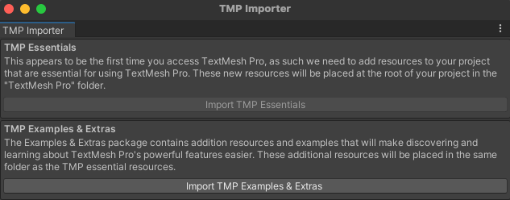

TeshMeshPro ajoute du texte de meilleure qualité à Unity. Lorsque tu l'utilises pour la première fois dans un projet, tu verras apparaître une fenêtre contextuelle te demandant d'importer les éléments essentiels, les exemples et les extras de TextMeshPro dans ton projet. Clique successivement sur les deux boutons Import, puis ferme la fenêtre :

