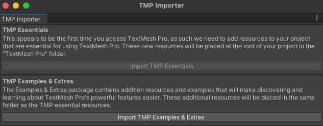

TeshMeshPro voegt tekst van betere kwaliteit toe aan Unity. Wanneer je het voor de eerste keer in een project gebruikt, zie je een pop-upvenster waarin je wordt gevraagd de essentiële onderdelen, voorbeelden en extra's van TextMeshPro in jouw project te importeren. Klik achtereenvolgens op de twee importknoppen en sluit vervolgens het venster:

